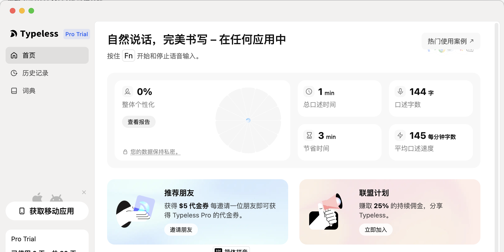
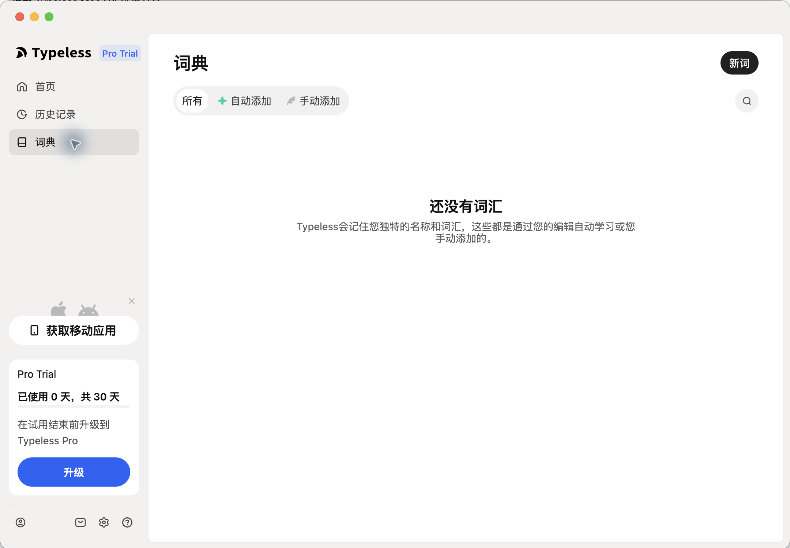
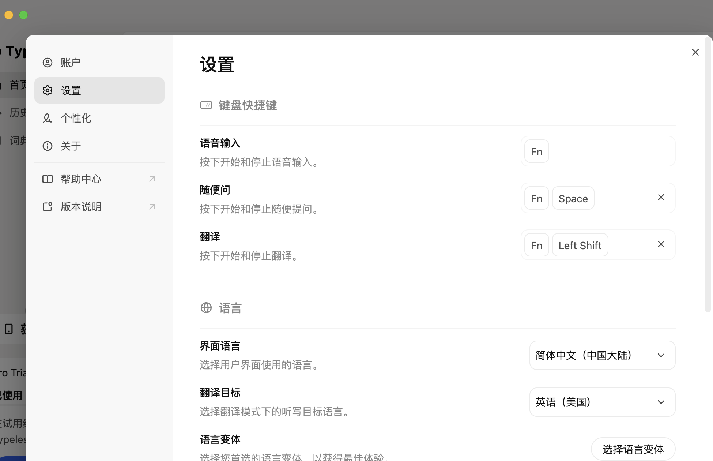
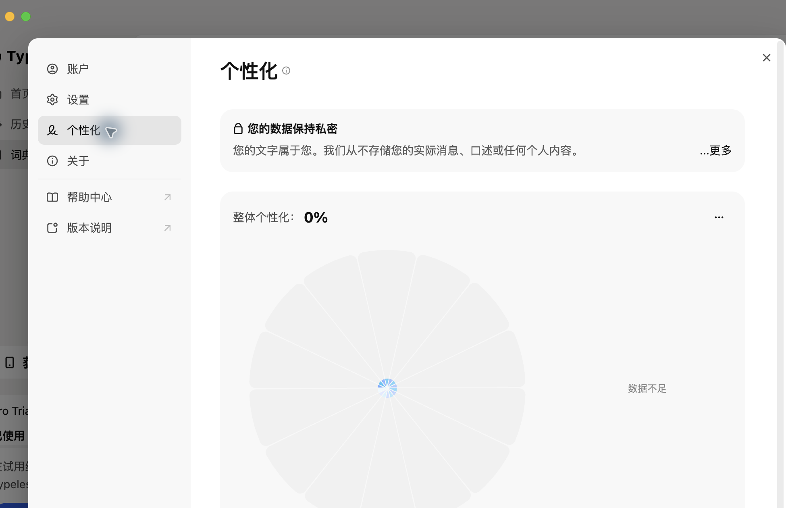

# Typeless Mac UX Teardown：可复刻、可评估、可设计的证据文档

状态：Evidence draft
日期：2026-05-02
范围：Typeless macOS 桌面端交互拆解
主要方法：使用 Computer Use 观察本机 Typeless Mac App

## 1. 文档目标

这份文档把 Typeless Mac 端的实际交互拆成三类可用资产：

- 可复刻：明确入口、前置条件、触发方式、界面状态、结果和风险边界。
- 可评估：把体验拆成可打分、可测试、可复验的指标。
- 可设计：提炼可以迁移到自研产品里的模式、组件和设计要求。

这不是营销介绍，也不是功能清单，而是基于可观察证据的 UX teardown。

## 2. 验收标准

受众：

- 产品经理、UX 设计师、客户端工程师、AI 语音输入产品研究人员。

成功标准：

1. 每个主要判断都能追溯到 Computer Use 观察到的界面状态或本地 App 元数据。
2. 至少覆盖 Home、History、Dictionary、Settings、Personalization、Account、About 七类界面。
3. 每个核心流程包含复刻步骤、预期结果和评估指标。
4. 明确标注未执行的高风险动作，例如发送反馈、词典写入、升级、购买、检查更新、登出。
5. 不泄露本机历史记录、账号邮箱、联系人、电话等个人信息。

失败条件：

- 直接引用本机历史记录中的个人内容。
- 把未实测的实时录音、听写插入、翻译结果说成已验证。
- 只描述界面，不给评估方法和设计迁移建议。

## 3. 证据边界

已观察：

- 打开 `/Applications/Typeless.app`。
- 读取本地 App Bundle 元数据。
- 通过 Computer Use 观察 Home、History、Dictionary、Settings、Personalization、Account、About。
- 打开 History 保留周期下拉、Dictionary 搜索、新词弹窗、麦克风选择器、Personalization 展开说明。
- 在 TextEdit 中由用户物理按键触发真实 `Fn` toggle 听写，观察文本插入、本地录音文件、History 留痕和实时 overlay 截图。

未执行：

- 未提交反馈。
- 未升级、购买礼品卡、检查更新、登出或打开外部帮助/政策链接。
- 未新增、编辑或删除历史记录、词典、设置项。

隐私处理：

- 观察过程中 Typeless 暴露了本机历史片段和账号邮箱。
- 本文只记录界面结构，不引用这些个人内容。
- 后续如需扩展到聊天、邮件、浏览器或词典写入测试，必须继续使用一次性无敏感脚本，并在触发外发或持久写入前单独确认。

## 4. 环境快照

| 字段 | 证据 |
| --- | --- |
| App | Typeless |
| Bundle ID | `now.typeless.desktop` |
| 版本 | `1.2.1` |
| Build | `1.2.1.97` |
| 安装路径 | `/Applications/Typeless.app` |
| Renderer URL | `file:///Applications/Typeless.app/Contents/Resources/app.asar/dist/renderer/hub.html` |
| 观察到的界面语言 | 简体中文为主，部分文案仍为英文 |
| 观察到的计划状态 | Pro Trial，已使用 0 天，共 30 天 |

## 5. 证据索引

| ID | 界面/状态 | 关键观察 | 证据质量 |
| --- | --- | --- | --- |
| CU-01 | App 发现 | 本机安装 Typeless，Bundle 元数据可读。 | 高 |
| CU-02 | Home | 主承诺、`Fn` 触发、用量指标、个性化、隐私信号、推荐/联盟、反馈、版本。 | 高 |
| CU-03 | History | 本地历史保留、隐私说明、All/Dictation/Ask 筛选、按日期分组的历史行、重试/查看答案。 | 高，个人内容已脱敏 |
| CU-04 | History 保留周期 | 选项为：从不、24小时、1周、1个月、永远。 | 高 |
| CU-05 | Dictionary | 所有/自动添加/手动添加、搜索、新词弹窗、空状态。 | 高 |
| CU-06 | Settings | 快捷键、界面语言、翻译目标、语言变体、麦克风、交互音、听写时静音、登录启动、Dock 显示。 | 高 |
| CU-07 | 麦克风选择器 | 自动检测和已检测设备；说明用户可在指示条不动时切换麦克风。 | 中 |
| CU-08 | Personalization | 隐私解释、抽象写作风格学习、0% 个性化、数据不足、联系入口。 | 高 |
| CU-09 | Account | 邮箱、订阅、升级、礼品卡、退出登录。邮箱已脱敏。 | 高，个人内容已脱敏 |
| CU-10 | About | 版本、检查更新、隐私政策、服务条款。 | 高 |
| CU-11 | 物理 Toggle 端到端 | TextEdit 输入框已聚焦且可写；用户按一次 `Fn` 开始、再按一次结束后，Typeless 插入文本、生成录音文件，并进入 History。 | 高 |
| CU-12 | 实时 overlay | 真实听写过程中捕捉到菜单栏橙色麦克风指示，以及底部黑色 pill 的波形/等待点/取消/确认控件。 | 中高，截图可见但未精确计时 |
| CU-13 | Pipeline 网络受控测试 | 无敏感短句产生新 DB 行和录音文件；录音窗口内出现对 AWS Global Accelerator 的 outbound bytes；本地 metadata 未暴露 provider/timing。 | 中高，客户端可见但服务端 provider 不可见 |

## 6. 总体交互模型

Typeless Mac 不是一个写作编辑器，而是一个系统级语音写作层。它由三层组成：

1. 环境捕获层

   用户停留在任意写作 App 中，通过全局快捷键触发听写、提问或翻译。Hub 不是主要输入场，而是控制台。

2. Hub 控制层

   Home、History、Dictionary、Settings、Personalization、Account 共同承担状态查看、配置、记忆管理、隐私解释和反馈入口。

3. 信任与商业层

   Pro Trial、升级、推荐奖励、联盟计划、隐私说明、反馈表单被放在同一个 Hub 里。它既服务使用，也推动转化和增长。

## 7. 屏幕拆解

### 7.1 Home

观察到的结构：

- 左侧主导航：首页、历史记录、词典。
- 左侧辅助区：获取移动应用、Pro Trial 卡片、底部四个图标入口。
- 主标题：自然说话，完美书写，在任何应用中。
- 主触发提示：围绕 `Fn` 启动/停止语音输入。
- 热门使用案例按钮。
- 整体个性化卡片：百分比、查看报告、隐私说明。
- 用量指标：总口述时间、口述字数、节省时间、平均口述速度。
- 推荐朋友和联盟计划卡片。
- 反馈意见模块，绑定“最后的转录”。
- 版本号和检查更新入口。

设计判断：

- Home 同时是 Dashboard、触发教学页、增长页和反馈页。
- 核心心智被压缩成一个键：`Fn`。
- 推荐/联盟/升级占据可见空间，商业信息与核心使用信息并列。

需要复刻的设计要素：

- 一屏内展示主触发方式。
- 显示用量和效率收益。
- 给个性化和隐私一个可见入口。
- 把最后一次输出和反馈绑定起来。

### 7.2 History

观察到的结构：

- 标题：历史记录。
- 顶部保留周期设置：询问用户希望在设备上保存口述历史多久。
- 保留周期选项：从不、24小时、1周、1个月、永远。
- 隐私说明：语音口述是私密的，零数据保留，只存储在设备上。
- 筛选：全部、听写、问任何问题。
- 空状态：无口述时解释历史会出现在这里。
- 有数据时按日期分组，行内包含时间、内容预览和操作按钮。
- 取消的转录显示“重试”。
- Ask 类型记录显示“查看答案”。

设计判断：

- History 被设计成“本地、可控、私密的记忆层”。
- “永远”本地保留和“零数据保留”同时出现，容易让用户混淆云端保留与本地历史。
- 多个行级按钮在无障碍树里是未命名按钮，后续设计应避免。

需要复刻的设计要素：

- 把本地历史保留放在 History 顶部，不埋进 Settings。
- 明确区分 Dictation 和 Ask 两类历史。
- 对取消、失败、可重试状态做专门行态。
- 每个行级操作都要有文字标签或可访问名称。

### 7.3 Dictionary

观察到的结构：

- 标题：词典。
- 新词按钮。
- 筛选：所有、自动添加、手动添加。
- 搜索入口默认以图标形式存在，点击后展开搜索框。
- 空状态说明 Typeless 会通过用户编辑自动学习，或由用户手动添加。
- 新词弹窗只包含一个输入框，以及取消/添加词汇。

设计判断：

- Dictionary 不只是词表，而是“产品记住用户术语”的记忆机制。
- 自动学习和手动添加被放在同一个模型里，这对语音产品很关键。
- 已观察的新词弹窗过于轻量，未看到发音、别名、大小写、语言、导入导出等高级字段。

需要复刻的设计要素：

- 词条来源必须可区分：自动学习 vs 手动添加。
- 搜索和审核要放在主界面。
- 新增词条默认简单，但高级字段要可展开。

### 7.4 Settings

观察到的结构：

- 键盘快捷键：
  - 语音输入：`Fn`
  - 随便问：`Fn` + `Space`
  - 翻译：`Fn` + `Left Shift`
- 语言：
  - 界面语言：简体中文（中国大陆）
  - 翻译目标：英语（美国）
  - 语言变体选择
- 音频：
  - 麦克风：自动检测，可选已检测设备
  - 交互声音：开启
  - 语音输入时静音其他活动音频：开启
- 应用行为：
  - 登录时启动应用：开启
  - 在 Dock 中显示应用：开启

设计判断：

- 快捷键把产品拆成三种模式：听写、提问、翻译。
- 设置分组很清晰：触发方式、语言、音频、应用行为。
- 存在文案不一致：Home 视觉文案偏“按住 Fn”，Settings 文案偏“按下开始和停止”。这会影响用户对 push-to-talk 和 toggle-to-record 的理解。

需要复刻的设计要素：

- 快捷键配置必须展示模式含义，而不只是按键。
- 需要冲突检测、恢复默认、清除快捷键后的安全状态。
- 录音前必须能看懂麦克风和静音行为。

### 7.5 Personalization

观察到的结构：

- 标题：个性化。
- 隐私解释：
  - 用户的文字属于用户。
  - Typeless 称不会存储实际消息、口述或个人内容。
  - AI 学习的是抽象写作模式，例如正式/随意偏好。
  - 展开说明使用“识别手写而不阅读文字”的类比。
- 整体个性化：0%。
- 状态：数据不足。
- 联系入口：可通过邮件咨询个性化问题。

设计判断：

- 个性化被设计成信任对象，而不是单纯功能开关。
- 0% 和数据不足说明了当前状态，但缺少“如何提升”的下一步指引。

需要复刻的设计要素：

- 先解释数据模型，再展示个性化分数。
- 低分或数据不足时必须给可行动建议。
- 用户应能暂停、重置、审查或关闭个性化。

### 7.6 Account 和 About

Account 观察到的结构：

- 已登录邮箱，本文已脱敏。
- 订阅：Pro Trial。
- 升级入口。
- 礼品卡购买入口。
- 退出登录。

About 观察到的结构：

- 版本：`v1.2.1`。
- 检查更新。
- 隐私政策。
- 服务条款。

设计判断：

- Account/About 是生命周期控制区，包含会话、商业、版本和政策。
- 升级、购买、检查更新、登出都可能改变账户或系统状态，自动化 teardown 中应只观察，不执行。

## 8. 可复刻流程

### Flow A：首页理解

目标：

- 用户在首次进入 Hub 时理解 Typeless 的主价值和主触发方式。

复刻步骤：

1. 启动 Typeless。
2. 停留在 Home。
3. 观察主标题和 `Fn` 触发提示。
4. 观察 Pro Trial、用量指标、个性化卡片、隐私提示。
5. 观察底部版本和反馈区域。

预期结果：

- 用户能在 5 秒内说出：Typeless 是跨 App 的语音写作工具。
- 用户知道核心触发键是 `Fn`。
- 用户能找到历史、词典、设置和反馈入口。

评估指标：

| 指标 | 通过标准 |
| --- | --- |
| 主触发可发现性 | 首屏可见，不需要滚动。 |
| 跨 App 心智 | 文案明确表达“任何应用中”或同等含义。 |
| 信任信号 | 不打开设置也能看到隐私提示。 |
| 商业打扰度 | 推荐/升级不遮挡主触发路径。 |

### Flow B：配置语音交互

目标：

- 用户能配置全局语音输入行为。

复刻步骤：

1. 打开 Settings。
2. 观察语音输入、随便问、翻译的快捷键。
3. 观察界面语言和翻译目标。
4. 观察麦克风选择与音频开关。
5. 观察登录启动和 Dock 显示。

预期结果：

- 用户能区分三种模式：听写、提问、翻译。
- 用户能找到麦克风、语言、静音、启动项设置。

评估指标：

| 指标 | 通过标准 |
| --- | --- |
| 模式区分 | 三种模式各自有名称、说明和快捷键。 |
| 文案一致 | Home 和 Settings 对 `Fn` 的动作描述一致。 |
| 快捷键安全 | 删除或修改快捷键后可恢复，有冲突提示。 |
| 录音前可理解 | 麦克风和听写时静音行为清楚。 |

### Flow C：管理本地历史

目标：

- 用户理解历史记录保存在哪里、保存多久、如何筛选和处理。

复刻步骤：

1. 打开 History。
2. 观察保留周期说明。
3. 打开保留周期下拉。
4. 记录所有选项。
5. 观察全部、听写、问任何问题筛选。
6. 观察行状态，但不引用个人内容。

预期结果：

- 用户能调整本地保留周期。
- 用户能理解历史是设备本地数据。
- 用户能区分听写历史和 Ask 历史。

评估指标：

| 指标 | 通过标准 |
| --- | --- |
| 保留周期可发现 | History 顶部可见。 |
| 隐私语义准确 | 明确区分云端零保留和本地历史保留。 |
| 行操作可理解 | 重试、查看答案、更多等动作都有标签。 |
| 敏感预览控制 | 长内容或疑似个人内容不被过度暴露。 |

### Flow D：管理词典

目标：

- 用户能添加、搜索、审核 Typeless 学到的术语。

复刻步骤：

1. 打开 Dictionary。
2. 观察所有、自动添加、手动添加。
3. 打开搜索框。
4. 打开新词弹窗。
5. 不输入内容，点击取消。

预期结果：

- 用户能理解词典有自动学习和手动添加两种来源。
- 用户能看到新增词条入口。
- 用户能搜索已有词条。

评估指标：

| 指标 | 通过标准 |
| --- | --- |
| 来源清晰 | 自动添加和手动添加可筛选。 |
| 词条信息量 | 至少支持词、大小写、别名、发音、语言等可选字段。 |
| 取消安全 | 取消后不会新增词条。 |
| 空状态有用 | 解释词典如何变得有内容。 |

### Flow E：理解个性化

目标：

- 用户理解 Typeless 如何学习写作风格，以及当前个性化程度。

复刻步骤：

1. 打开 Personalization 或 Home 的查看报告。
2. 阅读隐私解释。
3. 展开更多说明。
4. 观察个性化分数和数据状态。

预期结果：

- 用户知道 Typeless 声称学习的是抽象模式，而不是具体内容。
- 用户知道当前为什么是 0% 或数据不足。
- 用户知道哪里可以咨询问题。

评估指标：

| 指标 | 通过标准 |
| --- | --- |
| 数据模型清晰 | 说明“学什么”和“不存什么”。 |
| 分数可解释 | 分数有原因和下一步建议。 |
| 控制权 | 支持暂停、重置、审查或关闭。 |
| 信任语言具体 | 避免把本地历史和云端保留混为一谈。 |

### Flow F：提交最后一次转录反馈

目标：

- 用户能针对一次具体输出给反馈。

观察到的状态：

- Home 有反馈输入框。
- 反馈模块绑定“最后的转录”。
- 未输入反馈时发送按钮禁用。

安全复刻协议：

1. 使用无敏感内容的测试转录。
2. 输入简短反馈。
3. 在发送前确认，因为反馈会传给 Typeless。

评估指标：

| 指标 | 通过标准 |
| --- | --- |
| 反馈上下文 | 用户能看到反馈对应哪次输出。 |
| 外发透明 | 发送前知道反馈和哪些上下文会被传输。 |
| 禁用态清晰 | 空输入时发送不可点。 |
| 可撤回上下文 | 用户能移除或切换关联转录。 |

### Flow G：物理 Toggle 端到端测试

目标：

- 验证 Typeless 在真实物理 `Fn` 触发下，是否能从系统级录音进入文本插入，并留下本地记录。

真实交互模型：

- 按一次 `Fn` 后放开：开始录音。
- 说话。
- 再按一次 `Fn` 后放开：结束录音并触发识别。

测试协议：

1. 打开一次性文本输入框，例如 TextEdit 新文档、Notes 草稿，或不会误发送的聊天输入框。
2. 点击输入框，确认出现插入光标。
3. 必要时先输入并删除一个探针字符，证明目标可写。
4. 按一次当前语音输入快捷键并放开，开始录音。
5. 朗读无敏感测试句。
6. 再按一次当前语音输入快捷键并放开，结束录音并触发识别。
7. 等待处理结果。
8. 观察录音态、处理中态、插入结果、历史记录和反馈入口。

本轮证据：

| 检查项 | 观察 |
| --- | --- |
| 输入目标 | TextEdit 未命名文档。 |
| 焦点确认 | TextEdit 文本输入区是当前输入目标，且探针字符可输入、可删除。 |
| 触发方式 | 用户物理按一次 `Fn` 开始，说话后再按一次 `Fn` 结束。 |
| 插入结果 1 | TextEdit 文本区值变为“你好你好你好”。 |
| 本地录音 1 | `Recordings` 从 11 个增加到 12 个，最新录音时间为 2026-05-02 01:12:58。 |
| History 留痕 1 | History 顶部出现今天 01:12 AM 的测试记录，内容为“你好你好你好”。 |
| 插入结果 2 | TextEdit 文本区值变为“请把今天的测试结果整理成三条简短结论”。 |
| 本地录音 2 | `Recordings` 从 13 个增加到 14 个，最新录音时间为 2026-05-02 01:22:07。 |
| 插入结果 3 | TextEdit 文本区值变为“1、2、3、4、5”。 |
| 本地录音 3 | `Recordings` 从 14 个增加到 15 个，最新录音时间为 2026-05-02 01:26:50。 |
| 录音中 overlay | 菜单栏出现橙色麦克风指示；屏幕底部出现黑色 pill，包含取消按钮、音频波形和确认按钮。 |
| 处理中/等待 overlay | 截图捕捉到底部黑色 pill 的音频波形和等待点两种形态；但没有“正在处理”文字标签，状态语义需要用户从动效推断。 |
| Home 反馈面板 | 观察时 Home 的“最后的转录”未同步显示本次测试记录。 |

截图证据：

原始整屏截图存档：

- `assets/typeless-overlay-recording-full.png`
- `assets/typeless-overlay-waiting-full.png`

设计判断：

- Typeless 的端到端主链路是：当前输入焦点 -> `Fn` 开始录音 -> 用户说话 -> `Fn` 结束录音 -> 识别处理 -> 光标处插入 -> History 留痕。
- Home 文案“按住 Fn 开始和停止语音输入”容易让用户误解为长按模式；如果真实行为是 toggle，应改成“按一次 Fn 开始录音，再按一次结束”。
- 普通听写模式倾向于把用户说出的话作为文本插入；当用户说出“整理成三条结论”这类任务指令时，结果仍可能是字面转录，而不是执行改写。
- 录音中状态可见性较强：macOS 菜单栏橙色麦克风指示和 Typeless 底部黑色 pill 同时出现。
- 处理中状态可见性偏弱：等待点能暗示系统忙碌，但缺少文字标签、阶段名或明确倒计时，用户需要猜测当前是录音、上传、识别还是插入前等待。
- History 能及时显示最新记录，但 Home 的“最后的转录”在本轮观察中未同步更新，反馈入口和最新输出之间可能存在状态同步问题。

评估指标：

| 指标 | 记录方法 |
| --- | --- |
| 触发延迟 | 从第一次按键到录音态出现的时间。 |
| 停止延迟 | 从第二次按键到处理中态的时间。 |
| 插入延迟 | 从第二次按键到文本插入的时间。 |
| 状态可读性 | 录音、等待、处理、完成是否有独立视觉状态和文字标签。 |
| 文本质量 | 语义保留、去口语化、标点、格式、语气。 |
| 失败恢复 | 取消、重试、复制备用、权限恢复。 |
| 数据痕迹 | 是否进入 History，以及遵循哪个保留周期。 |

### Flow H：Pipeline 网络受控测试

目标：

- 判断 Typeless 更像边录边上传，还是结束后整段上传。
- 判断客户端是否直接连接第三方 ASR/LLM provider。
- 判断本地 DB 是否暴露 pipeline timing 或 provider 字段。

测试协议：

1. 打开 TextEdit 空白文档，保持输入焦点。
2. 记录测试开始时间、History 行数、Recordings 文件数。
3. 对 Typeless 相关进程启动 `nettop` 秒级 bytes 采样和 `lsof` 连接采样。
4. 用户物理按一次 `Fn` 开始录音，朗读无敏感短句。
5. 用户再按一次 `Fn` 结束录音，等待插入结果。
6. 只查询测试开始时间之后生成的最新 DB 行，不读取旧记录。

本轮证据：

| 检查项 | 观察 |
| --- | --- |
| 采样窗口 | 2026-05-02 02:01:30 至 02:02:43 CST。 |
| 插入结果 | TextEdit 插入“网络管线测试 1, 2, 3, 4, 5”。 |
| DB 留痕 | `history` 从 15 行增加到 16 行；新记录 `created_at` 为 2026-05-01T18:01:41.143Z，`updated_at` 为 2026-05-01T18:01:55.020Z。 |
| 录音文件 | `Recordings` 从 15 个增加到 16 个；最新 OGG/Opus 文件 mtime 为 2026-05-02 02:01:48，`ffprobe` 时长为 7.6225 秒。 |
| 录音窗口内网络 | `nettop` 在 02:01:42 记录 outbound 9,581 bytes，在 02:01:47 记录 outbound 5,816 bytes；这些发生在录音文件 mtime 02:01:48 之前或附近。 |
| 连接目标 | `lsof`/`nettop` 观察到 `127.0.0.1:7890`、`52.223.55.114:443`、`166.117.210.238:443`；远端 IP 反解为 `a7c510370f6d0d461.awsglobalaccelerator.com`。 |
| 本地 metadata | `debug_info` 外层是 JSON，但嵌套 debug 字段是不可读的加密文本；`audio_metadata` 只有格式、codec、采样率、声道等音频信息；`mode_meta.ai_result` 只暴露输出相关字段，未看到 `asr_duration`、`refine_duration`、`provider`。 |

设计判断：

- 这轮证据高度支持“录音未结束前已经发生网络传输”，因此 Typeless 更像边录边传，或至少在录音结束前就已建立并使用上传链路。
- 客户端没有直接暴露 OpenAI、Deepgram、AssemblyAI 等第三方 provider 连接；可见连接是 AWS Global Accelerator 和本地代理。因此，本机只能确认 Typeless 连接到后端入口，无法确认服务端后面使用哪家 ASR/LLM。
- 本地 DB 没有可读的 pipeline timing/debug 字段。只能用 `created_at`、音频文件 mtime、`updated_at` 和网络采样做粗粒度时序复原。
- 对产品交互逻辑来说，录音动作不只是本地采集；从用户按下 `Fn` 开始，系统级语音层、网络链路、本地历史记录已经同时进入工作状态。

评估指标：

| 指标 | 记录方法 |
| --- | --- |
| 上传时机 | 对齐 `Fn` 开始/结束、`nettop` outbound bytes、录音文件 mtime。 |
| Provider 可见性 | `lsof`/`nettop` 远端目标、DNS 反解、客户端 bundle endpoint 字符串。 |
| Pipeline 可解释性 | 新 DB 行的 `debug_info`、`audio_metadata`、`mode_meta` 是否有 timing/provider 字段。 |
| 隐私边界 | 只使用无敏感短句，只读取测试时间之后的新行。 |

## 9. 可评估 Rubric

每项 0-3 分：

- 0 = 缺失或不可用
- 1 = 有但不清楚或不稳定
- 2 = 可用，有小问题
- 3 = 清楚、可靠、可复验

| 评估域 | 问题 | 需要收集的证据 |
| --- | --- | --- |
| 触发 | 用户能否不打开 Hub 直接听写？ | 快捷键、冲突处理、录音覆盖层。 |
| 状态清晰度 | 用户是否知道当前是空闲、录音、处理中、失败、已插入？ | 覆盖层截图、声音提示、历史状态。 |
| 文本质量 | 输出是否是可直接使用的成文，而非原始转录？ | 朗读脚本和输出对照。 |
| 上下文适配 | 同一句话在不同 App 里是否输出不同语气？ | 邮件、聊天、文档、IDE、浏览器矩阵。 |
| 插入可靠性 | 文本是否落在光标处？ | 原生 App、浏览器、Electron、IDE 的通过率。 |
| 隐私治理 | 用户能否控制本地保留并理解云端处理？ | 保留设置、隐私文案、删除/导出入口。 |
| 词典控制 | 用户能否教会产品专有名词？ | 新增、搜索、自动学习、修正测试。 |
| 个性化 | 用户能否理解并控制风格学习？ | 分数、解释、重置/暂停/关闭能力。 |
| 无障碍 | 图标按钮和行操作是否有可访问名称？ | Accessibility tree、键盘导航、VoiceOver。 |
| 本地化 | 中英文文案是否一致？ | UI copy sweep。 |
| 商业干扰 | 升级/推荐是否影响核心任务？ | 首屏占比、任务完成时间。 |

## 10. 可设计模式

### Pattern 1：一键环境语音层

可复用设计：

- Hub 首屏必须展示主触发键。
- 全局快捷键可配置。
- 听写、提问、翻译是三个独立模式。
- 同一个动作必须使用同一动词：按住、按下、切换，不要混用。

组件要求：

- 快捷键捕获器。
- 冲突检测。
- 恢复默认。
- 录音覆盖层。
- 录音权限健康检查。

### Pattern 2：带保留周期的本地历史

可复用设计：

- 把保留周期放在 History 顶部。
- 支持从不、短期、长期、永远。
- 区分听写结果和问答结果。
- 提供删除、导出、复制、重试等动作。

组件要求：

- 保留周期选择器。
- 类型筛选 chips。
- 历史行。
- 行操作菜单。
- 空状态。
- 敏感内容预览控制。

### Pattern 3：自动学习 + 手动添加的词典记忆

可复用设计：

- 词典是用户术语记忆，不只是设置页。
- 自动学习要可审核。
- 手动添加要足够轻，但能展开高级字段。

组件要求：

- 来源筛选。
- 新增词条弹窗。
- 搜索。
- 词条详情：词、别名、发音、大小写、语言、来源、置信度。

### Pattern 4：作为信任对象的个性化

可复用设计：

- 先解释数据模型，再展示分数。
- 数据不足时给下一步。
- 用户应能暂停、重置、查看或关闭。

组件要求：

- 个性化分数。
- 隐私解释折叠区。
- 数据充分性状态。
- 风格画像控制。
- 联系/支持入口。

### Pattern 5：绑定最后输出的反馈回路

可复用设计：

- 反馈必须绑定具体输出。
- 表单保持轻量。
- 外发前说明会发送哪些信息。

组件要求：

- 关联转录预览。
- 反馈输入框。
- 禁用发送态。
- 外发说明。
- 成功/失败状态。

## 11. 主要设计发现

### Finding 1：快捷键文案不一致

证据：

- Home 视觉文案偏“按住 Fn”。
- Settings 文案偏“按下开始和停止”。

影响：

- 用户无法判断 Typeless 是 push-to-talk 还是 toggle-to-record。
- 这可能造成误录音、提前停止或不知道何时结束。

设计建议：

- 先确定交互模型。
- 在 Home、Settings、Onboarding、Tooltip、Help 中统一文案。
- 如果同时支持按住和切换，必须明确写出并允许配置。

### Finding 2：隐私文案需要区分本地历史和云端保留

证据：

- History 可设置本地保留为“永远”。
- 同一区域强调“零数据保留”和“仅存储在设备上”。

影响：

- 用户可能误以为“零保留”和“永远保存”矛盾。

设计建议：

- 明确分成“云端处理保留”和“本机历史保留”。
- 清除本地历史、导出、删除入口应靠近保留周期。

### Finding 3：图标按钮需要可访问名称

证据：

- Home 底部图标按钮和 History 行级按钮多次在无障碍树中显示为未命名按钮。

影响：

- 屏幕阅读器用户无法理解动作。
- 自动化 QA 也难以稳定定位。

设计建议：

- 每个图标按钮提供 `aria-label` 或原生可访问名称。
- 低频动作加 Tooltip。
- 行操作明确命名为复制、重试、删除、反馈、更多等。

### Finding 4：词典新增模型偏薄

证据：

- 新词弹窗只观察到一个输入框。

影响：

- 人名、品牌、缩写、多语名词、发音变体很难稳定命中。

设计建议：

- 默认只填词，保持轻量。
- 高级字段支持大小写、别名、发音提示、语言、适用 App 或上下文。

### Finding 5：个性化分数缺少行动建议

证据：

- Personalization 显示 0% 和数据不足。

影响：

- 用户知道结果，但不知道如何改善。

设计建议：

- 增加可行动提示，例如“再完成 3 次听写”或“纠正 5 次输出以建立风格”。
- 说明哪些信号会提升个性化，但不展示敏感原文。

### Finding 6：反馈入口位置好，但外发语义要更清楚

证据：

- Home 反馈绑定最后一次转录。
- 空输入时发送按钮禁用。

影响：

- 反馈上下文明确，但用户不一定知道发送时是否包含转录内容。

设计建议：

- 发送前加简短说明。
- 允许用户移除关联转录，只发送反馈文本。

### Finding 7：录音态清楚，处理中态不够自解释

证据：

- 真实听写时，macOS 菜单栏出现橙色麦克风指示。
- Typeless 底部黑色 pill 显示取消、波形和确认控件。
- 过程中捕捉到等待点形态，但未看到“正在处理”或同等文字标签。

影响：

- 用户能知道麦克风正在使用，但不一定知道 Typeless 当前处在录音、处理中还是等待插入。
- 在识别时间较长时，缺少阶段文案会放大不确定感。

设计建议：

- 在底部 pill 中区分“正在录音”“正在识别”“已插入”三种状态。
- 给等待态增加短文案或可访问名称，避免只依赖动效。
- 处理超过固定阈值时提供可取消、重试或复制备用结果。

## 12. 未验证缺口

以下需要明确授权或受控测试环境：

- 反馈/词典/纠错闭环，本轮按用户要求暂停，不提交反馈、不写入词典。
- 具体 ASR/LLM provider 和服务端 pipeline timing，本机只看到后端入口，无法确认服务端内部链路。
- 跨 App overlay 状态一致性。
- 麦克风权限恢复。
- 跨 App 文本插入。
- 不同 App 的上下文适配输出。
- Ask anything 的答案面板和答案历史详情。
- 翻译模式输出。
- 升级/支付路径。
- 外部帮助中心和版本说明。
- 检查更新行为。

## 13. 下一轮测试矩阵

| 测试 | App/场景 | 脚本 | 主指标 |
| --- | --- | --- | --- |
| 普通听写 | TextEdit 或 Notes | 无敏感两句短文 | 延迟和插入可靠性 |
| 聊天语气 | Telegram/Slack 类输入框 | 轻松状态更新 | 语气适配 |
| 邮件语气 | Mail/Gmail 草稿 | 专业回复 | 结构和礼貌程度 |
| 技术输入 | Cursor/ChatGPT 输入框 | Bug 描述或 Prompt | 术语保留 |
| 翻译 | 一次性文本框 | 简短中文到英文 | 译文自然度 |
| 选中文本提问 | 浏览器样本文本 | 总结成三条 bullet | 只读上下文处理 |
| 词典命中 | 虚构专有名词 | 专有名词必须正确出现 | 词典命中率 |
| 取消流程 | 启动后取消录音 | 不说敏感内容 | 恢复和历史状态 |
| 物理键触发 | TextEdit + 真人按一次 Fn 开始、再按一次 Fn 结束 | 无敏感两句短文 | overlay、插入、History 留痕 |

## 14. 可设计交付种子

如果要设计一个 comparable Mac voice-input 产品，可以从这些模块开工：

1. 全局激活控制器
   - 听写、提问、翻译三模式
   - 快捷键编辑
   - 录音覆盖层
   - 权限健康状态

2. 历史和数据控制
   - 本地保留周期
   - 云端处理披露
   - 行操作
   - 敏感预览设置

3. 词典记忆
   - 自动/手动来源
   - 词条元数据
   - 导入/导出
   - 纠错反馈回路

4. 风格个性化
   - 抽象风格画像
   - 数据充分性仪表
   - 暂停/重置控制
   - 可解释信号

5. 质量反馈回路
   - 最后输出锚点
   - 反馈输入
   - 上下文包含控制
   - 外发确认

## 15. 结论

Typeless Mac 的核心不是“打开一个编辑器写字”，而是“在任何 App 里用声音触发一个系统级写作层”。Hub 的职责是解释、配置、治理和复盘这个环境层。

最值得复刻的设计资产是三模式快捷键、History 顶部本地保留控制、自动/手动词典、个性化隐私解释，以及绑定最后一次输出的反馈回路。

最需要警惕的设计风险是：`Fn` 的按住/按下文案不一致，本地历史和云端零保留容易混淆，图标按钮无障碍标签不足，词典和个性化缺少高阶控制与下一步引导。
